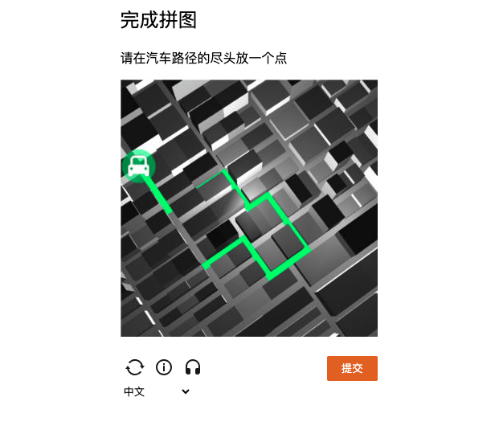
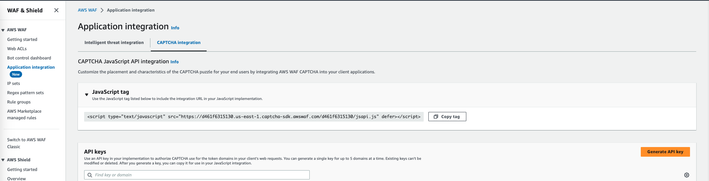

# 使用Javascript SDK 实现拼图验证
默认在WAF web acl中，直接对被保护的资源使用 CAPTCHA 拼图 action, 就可以实现web 页面的CAPTCHA 拼图 保护

但是如果要实现自定义的一些逻辑，例如，同一个用户多次登陆失败后，弹出CAPTCHA 拼图验证，则需要使用SKD

这个repo 演示如何使用javascript 实现同一个用户多次登陆失败后，弹出CAPTCHA 拼图验证，验证成功后重新提供登录页面


# API 文档
https://docs.aws.amazon.com/zh_cn/waf/latest/developerguide/waf-js-challenge-api-fetch-wrapper.html

# 演示过程
请在linux机器上运行，假设已经安装好python3.6+环境
1. 在命令行输入 python3 -m http.server 5016
2. 用浏览器打开localhost:5016
3. 界面应该会弹出 这是您第 1 次访问该页面
4. 继续刷新页面，页面弹出 这是您第 2 次访问该页面
5. 继续刷新页面，页面弹出 这是您第 3 次访问该页面.
6. 由于您已经三次访问了该页面，页面认为你频繁访问，为了限制您的访问，将显示拼图认证
7. 只有您正确完成拼图认证，页面会弹出 在这里渲染登陆的页面html


# 配置过程
1. 请如下图在WAF上配置api key

2. 在index.html 的head 引入依赖javascript 库
```
<head>
    <meta charset="UTF-8">
    <script type="text/javascript" charset="utf-8"
        src="https://d461f6315130.us-east-1.captcha-sdk.awswaf.com/d461f6315130/_/jsapi.js" defer></script>
</head>
```
3. 参考index.html 修改成您的代码
